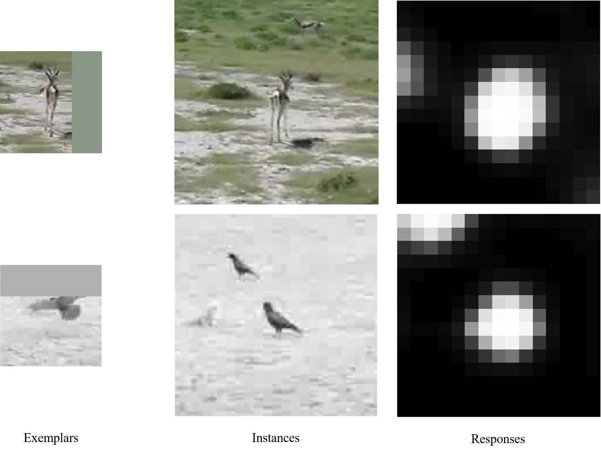
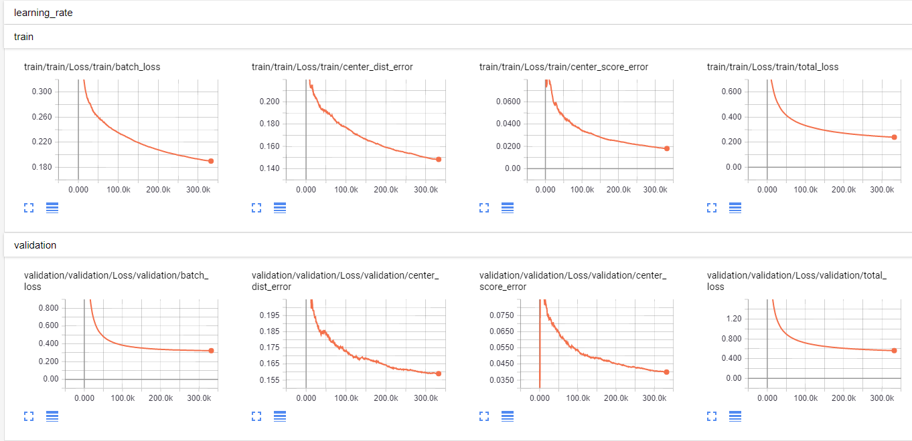

# SiamFC-TensorFlow
A TensorFlow implementation of the SiamFC tracker

## Introduction

This is a TensorFlow implementation of [Fully-Convolutional Siamese Networks for Object Tracking](https://arxiv.org/abs/1606.09549). You can find the original MatConvNet version [here](https://github.com/bertinetto/siamese-fc). The SiamFC authors have also  released a TensorFlow port of the tracking part (using pretrained model only) in [here](https://github.com/torrvision/siamfc-tf). 

This TensorFlow implementation is designed with these goals:
- [x] **Self-contained**. Data preparation, model training, tracking, visualization and logging all in one.
- [x] **Correctness**. The tracking performance should be similar to the MatConvNet version.
- [x] **Efficiency**. The training and inference procedures should be as efficient as possible.
- [x] **Modularization**. The whole system should be modularized and easy to expand with new ideas.
- [x] **Readability**. The code should be clear and consistent.

## Main Results
In a computer with a `GeForce GTX 1080` GPU, the main results on OTB-100 are in the table below. Note that the performance of SiamFC-3s-color trained from scratch using our implementation is consistently better than SiamFC-3s-gray-scratch. Moreover, We observe that the tracking performance of saved models in different epochs varies considerably, therefore, you may want to evaluate a few more models instead of just picking the model in the last epoch.  

|                   | Reported (AUC)     | Pretrained (AUC)       | Train from scratch (AUC)  | Training time | Tracking time|
|-------------------|:-------------------:|:---------------------:|:-----:|:--------------:|:------------------:|
|SiamFC-3s-color  | --                      | 0.578        | 0.584            | ~5h        | ~120fps            |
|SiamFC-3s-gray   | 0.582                   | 0.587        | 0.573            | ~5h        | ~120fps            |

Qualitative results:



## Prerequisite
The main requirements can be installed by:
```bash
# (OPTIONAL) 0. It is highly recommended to create a virtualenv or conda environment
# For example, 
#       conda create -n tensorflow1.4 python=2.7
#       source activate tensorflow1.4

# 1. Install TensorFlow 1.4.0 
# Version 1.4.0 is required for training since we use tf.data API
# You can use TensorFlow > 1.0 for tracking though.
# Note the tracking performance slightly varies in different versions.
# pip install tensorflow    # For CPU
pip install tensorflow-gpu  # For GPU

# 2. Install scipy for loading mat files
pip install scipy

# 3. Install sacred for experiments logging
pip install sacred

# 4. Install matplotlib for visualizing tracking results
pip install matplotlib

# 5. Install opencv for preprocessing training examples
pip install opencv-python

# 6. Install pillow for some image-related operations
pip install pillow

# (OPTIONAL) 7. Install nvidia-ml-py for automatically selecting GPU
pip install nvidia-ml-py
```

## Tracking
```bash
# 1. Clone this repository to your disk
git clone https://github.com/bilylee/SiamFC-TensorFlow.git

# 2. Change working directory
cd SiamFC-TensorFlow

# 3. Download pretrained models and one test sequence 
python scripts/download_assets.py

# 4. Convert pretrained MatConvNet model into TensorFlow format.
# Note we use SiamFC-3s-color-pretrained as one example. You
# Can also use SiamFC-3s-gray-pretrained. 
python experiments/SiamFC-3s-color-pretrained.py

# 5. Run tracking on the test sequence with the converted model
python scripts/run_tracking.py

# 6. Show tracking results
# You can press Enter to toggle between play and pause, and drag the 
# scrolling bar in the figure. For more details, see utils/videofig.py
python scripts/show_tracking.py
```

## Training
```bash
# 1. Download and unzip the ImageNet VID 2015 dataset (~86GB)
# Now, we assume it is unzipped in /path/to/ILSVRC2015
DATASET=/path/to/ILSVRC2015

# 2. Clone this repository to your disk 
# (Skip this step if you have already done it in the Tracking section)
git clone https://github.com/bilylee/SiamFC-TensorFlow.git

# 3. Change working directory
cd SiamFC-TensorFlow

# 4. Create a soft link pointing to the ImageNet VID dataset
mkdir -p data
ln -s $DATASET data/ILSVRC2015

# 5. Prepare training data
# If you have followed the data preparation procedures in 
# the MatConvNet implementation, simply create a soft link 
# pointing to the curated dataset:
#       ln -s $CURATED_DATASET data/ILSVRC2015-VID-Curation
# Otherwise, create it from scratch by
python scripts/preprocess_VID_data.py

# 6. Split train/val dataset and store corresponding image paths
python scripts/build_VID2015_imdb.py

# 7. Start training
# You can get quite good results after ~70k iterations.
python experiments/SiamFC-3s-color-scratch.py

# 8. (OPTIONAL) View the training progress in TensorBoard
# Open a new terminal session and cd to SiamFC-TensorFlow, then
tensorboard --logdir=Logs/SiamFC/track_model_checkpoints/SiamFC-3s-color-scratch
```

Example TensorBoard outputs are like:



## Benchmark
You can use the `run_SiamFC.py` in `benchmarks` directory to integrate with the OTB evaluation toolkit. The OTB toolkit has been ported to python. The original version is [here](https://github.com/jwlim/tracker_benchmark). However, you may want to use my [custom version](https://github.com/bilylee/tracker_benchmark) where several bugs are fixed. 

Assume that you have followed the steps in `Tracking` or `Training` section and now have a pretrained/trained-from-scratch model to evaluate. To integrate with the evaluation toolkit, 
```bash
# Let's follow this directory structure
# Your-Workspace-Directory
#         |- SiamFC-TensorFlow
#         |- tracker_benchmark
#         |- ...
# 0. Go to your workspace directory
cd /path/to/your/workspace

# 1. Download the OTB toolkit
git clone https://github.com/bilylee/tracker_benchmark.git

# 2. Modify line 22 and 25 in SiamFC-TensorFlow/benchmarks/run_SiamFC.py accordingly. 
# In Linux, you can simply run
sed -i "s+/path/to/SiamFC-TensorFlow+`realpath SiamFC-TensorFlow`+g" SiamFC-TensorFlow/benchmarks/run_SiamFC.py

# 3. Copy run_SiamFC.py to the evaluation toolkit
cp SiamFC-TensorFlow/benchmarks/run_SiamFC.py tracker_benchmark/scripts/bscripts

# 4. Add the tracker to the evaluation toolkit list
echo "\nfrom run_SiamFC import *" >> tracker_benchmark/scripts/bscripts/__init__.py

# 5. Create tracker directory in the evaluation toolkit
mkdir tracker_benchmark/trackers/SiamFC

# 6. Start evaluation (it will take some time to download test sequences).
echo "tb100" | python tracker_benchmark/run_trackers.py -t SiamFC -s tb100 -e OPE

# 7. Get the AUC score
sed -i "s+tb50+tb100+g" tracker_benchmark/draw_graph.py
python tracker_benchmark/draw_graph.py
```

## License
SiamFC-TensorFlow is released under the MIT License (refer to the LICENSE file for details).
